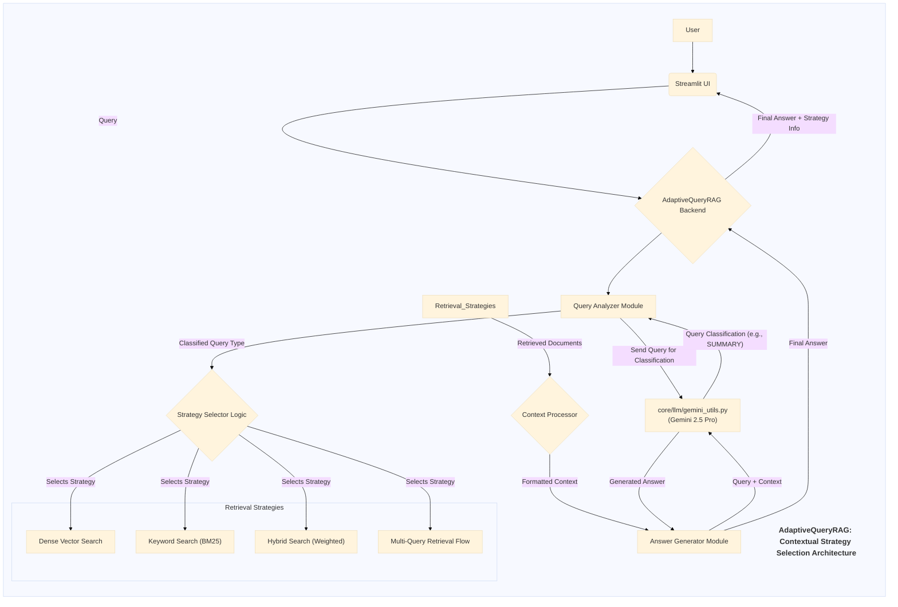

# Application Documentation: AdaptiveQueryRAG - Contextual Strategy Selection

- **Version:** 1.0
- **Parent Project:** [IntelliForge: Applied GenAI Playbook](../overview.md)
- **Application Folder:** [`apps/adaptive_query_rag/`](../../apps/adaptive_query_rag/)
- **App README:** [apps/adaptive_query_rag/README.md](../../apps/adaptive_query_rag/README.md)

---

## 1. Introduction

AdaptiveQueryRAG is a demonstration application within the IntelliForge suite showcasing a more intelligent **Retrieval-Augmented Generation (RAG)** system that **adapts its retrieval strategy based on the nature of the user's query**. Instead of using a single, fixed retrieval method (like only vector search or only keyword search) for all questions, this system first analyzes the query using Google's **Gemini 2.5 Pro** to understand the user's intent and information need. Based on this analysis, it dynamically selects or weights different retrieval approaches.

The primary goal is to illustrate that tailoring the retrieval strategy to the query type (e.g., factual lookup vs. summary vs. comparison) can lead to more relevant context being retrieved and, consequently, more accurate and helpful answers generated by the LLM. This represents a step towards more context-aware and efficient RAG systems.

## 2. Core AI Concept: Adaptive / Conditional RAG

AdaptiveQueryRAG demonstrates several related AI concepts:

- **Query Analysis/Classification:** Using an LLM (Gemini 2.5 Pro) to pre-process the user's query to understand its underlying intent or type. Example classifications might include:
  - *Factoid:* Seeking a specific, short answer.
  - *Summary:* Requesting a condensed overview of a topic.
  - *Comparison:* Asking to compare/contrast two or more entities/concepts.
  - *Explanation:* Needing a detailed description or reasoning.
  - *Opinion/Subjective:* Seeking opinions or analysis (if the knowledge base contains them).
- **Conditional Logic:** Implementing rules or logic that map the classified query type to a specific retrieval strategy or combination of strategies.
- **Dynamic Strategy Selection:** The core idea – choosing the retrieval method(s) at runtime based on the query classification. This might involve:
  - Selecting a single best method (e.g., vector search for factoids, keyword for summaries).
  - Using a hybrid approach but dynamically adjusting the weights (e.g., higher weight for semantic search in explanatory queries).
  - Triggering specialized retrieval flows (e.g., multi-query retrieval for comparisons).
- **Parametric Tuning (Optional):** The selected strategy might also involve adjusting parameters like the number of documents to retrieve (`top_k`), chunk sizes, or similarity thresholds based on the query type.

## 3. Architecture & Workflow

AdaptiveQueryRAG introduces a query analysis step before proceeding with retrieval and generation.

### 3.1. Pre-computation/Indexing

Similar to other RAG applications, an initial indexing phase is required:

1. **Document Loading & Chunking:** (`core/utils/data_helpers.py`)
2. **Embedding Generation:** (`core/utils/retrieval_utils.py`)
3. **Vector Store Indexing:** (`core/utils/retrieval_utils.py`)
4. **Keyword Indexing (if used):** (`core/utils/retrieval_utils.py`)

### 3.2. Online Query Flow

1. **User Query:** User submits a query via the Streamlit UI (`src/app.py`).
2. **Query Analysis Module:**
    - The backend sends the user query to Gemini 2.5 Pro (via `core/llm/gemini_utils.py`) with a prompt specifically designed to classify the query type or intent.
    - The LLM returns the classification (e.g., "SUMMARY", "FACTOID", "COMPARISON").
3. **Strategy Selection Logic:** Based on the classification returned by the LLM, the backend logic selects the appropriate retrieval strategy. This is typically implemented as conditional logic (if/elif/else) within the application (`src/`). Examples:
    - If "FACTOID", prioritize vector search with `top_k=3`.
    - If "SUMMARY", use keyword search or vector search with larger `top_k` and potentially retrieve larger document chunks.
    - If "COMPARISON", trigger two separate searches (one for each item) and combine results, or use a hybrid approach.
4. **Retrieval Execution:** The chosen retrieval method(s) are executed using functions from `core/utils/retrieval_utils.py`, potentially with dynamically adjusted parameters.
5. **Context Formulation:** The retrieved context chunks are collected and formatted.
6. **LLM Generation:** The original query and retrieved context are sent to Gemini 2.5 Pro (via `core/llm/gemini_utils.py`) for final answer generation.
7. **Display Results:** The final answer, possibly along with information about the classified query type and the strategy used, is displayed in the Streamlit UI.

### 3.3. Architecture Diagram (Mermaid)



## 4. Key Features

- **Query Classification:** Uses LLM to automatically categorize user queries.
- **Dynamic Strategy Selection:** Chooses retrieval methods (vector, keyword, hybrid, multi-query) based on the classification.
- **Improved Relevance:** Aims to retrieve more relevant context by matching the strategy to the information need.
- **Transparency (Potential UI Feature):** Displays the inferred query type and the retrieval strategy chosen.
- **Flexible Retrieval Configuration:** Allows different parameters or methods to be associated with different query types.

## 5. Technology Stack

- **Core LLM:** Google Gemini 2.5 Pro
- **Language:** Python 3.8+
- **Web Framework:** Streamlit
- **Retrieval:** Vector DB (e.g., ChromaDB), Keyword Search (e.g., `rank_bm25`), Embedding Models via `core/utils/retrieval_utils.py`.
- **Core Utilities:** `google-generativeai`, `python-dotenv`, `pandas`.

## 6. Setup and Usage

*(Assumes the main project setup, including cloning and `.env` file creation, is complete as described in the main project [README](../../README.md) or [Overview](../overview.md).)*

1. **Navigate to App Directory:**

    ```bash
    cd path/to/IntelliForge-Applied-GenAI-Playbook/apps/adaptive_query_rag
    ```

2. **Create & Activate Virtual Environment (Recommended).**

3. **Install Requirements:**

    - Create/update `apps/adaptive_query_rag/requirements.txt` (e.g., `streamlit`, `google-generativeai`, `python-dotenv`, `chromadb-client`, `rank_bm25`, etc.).
    - Install: `pip install -r requirements.txt`

4. **Prepare Data & Indexes:**
    - Place source documents in `apps/adaptive_query_rag/data/`.
    - Run the necessary indexing process (shared utils) to populate vector and keyword stores.

5. **Run the Application:**

    ```bash
    streamlit run src/app.py
    ```

6. **Interact:**
    - Open the local URL provided by Streamlit.
    - Enter a query related to the indexed documents (try different types: "What is X?", "Summarize Y", "Compare A and B").
    - Observe the final answer. The UI might indicate the classified query type and the retrieval strategy employed by the backend. Compare results for different query types.

## 7. Potential Future Enhancements

- Refine the query classification taxonomy and prompting for greater accuracy.
- Implement more sophisticated strategy selection logic, potentially learned rather than rule-based.
- Allow dynamic adjustment of retrieval parameters (e.g., `top_k`) based on classification.
- Combine adaptive selection with self-correction features from ReflectiveRAG.
- Provide user controls to override the automatically selected strategy.
- Evaluate the performance uplift compared to a non-adaptive baseline RAG system.
