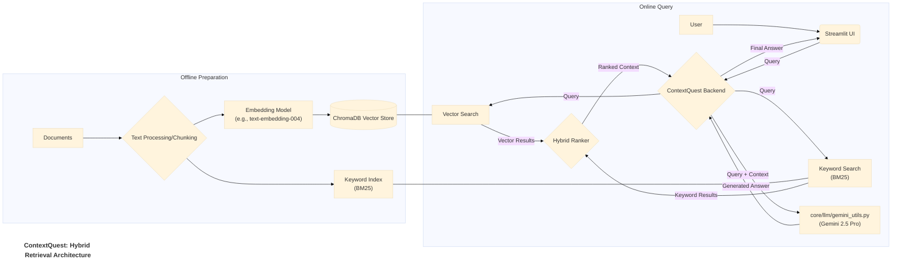

# Application Documentation: ContextQuest - Hybrid Retrieval

- **Version:** 1.0
- **Parent Project:** [IntelliForge: Applied GenAI Playbook](../overview.md)
- **Application Folder:** [`apps/context_quest/`](../../apps/context_quest/)
- **App README:** [apps/context_quest/README.md](../../apps/context_quest/README.md)

---

## 1. Introduction

ContextQuest is a demonstration application within the IntelliForge suite designed to showcase a **Hybrid Retrieval-Augmented Generation (RAG)** system. It addresses the challenge of retrieving the most relevant information from a knowledge base (a collection of documents) to answer user queries accurately.

Unlike basic RAG systems that might rely solely on either keyword search or semantic search, ContextQuest combines both approaches. It leverages the precision of keyword matching (using algorithms like BM25) with the contextual understanding of semantic search (using vector embeddings) to retrieve a richer, more relevant set of context documents. This retrieved context is then provided to Google's **Gemini 2.5 Pro** model to generate a final, grounded answer.

The goal is to illustrate how hybrid retrieval can potentially overcome the limitations of individual search methods (e.g., keyword search missing synonyms, semantic search sometimes drifting off-topic) leading to more robust RAG performance.

## 2. Core AI Concept: Hybrid Retrieval

The central AI technique demonstrated by ContextQuest is **Hybrid Retrieval**. This involves:

- **Keyword Search (Sparse Retrieval):** Using algorithms like Okapi BM25 that match the exact words or terms in the query against the documents. It excels at finding documents containing specific keywords or phrases.
- **Semantic Search (Dense Retrieval):** Converting both the query and document chunks into dense vector embeddings (numerical representations capturing meaning). It finds documents that are semantically similar (related in meaning) to the query, even if they don't share the exact keywords.
- **Result Combination/Ranking:** Implementing a strategy to combine the results from both search methods. This could involve:
  - **Weighted Combination:** Assigning weights to the relevance scores from each method and calculating a combined score.
  - **Reciprocal Rank Fusion (RRF):** Combining rankings based on the reciprocal of the rank position in each result list.
  - Other re-ranking techniques.

By blending these methods, ContextQuest aims to retrieve a set of documents that is both keyword-relevant and semantically related to the user's query.

## 3. Architecture & Workflow

ContextQuest operates in two main phases: Offline Preparation (Indexing) and Online Querying. It utilizes shared components from `core/` for LLM interaction and common utilities.

### 3.1. Offline Preparation (Indexing)

This phase prepares the documents for efficient retrieval. It typically involves:

1. **Document Loading:** Loading source documents from the `data/` directory (using `core/utils/data_helpers.py`).
2. **Text Processing/Chunking:** Cleaning and splitting documents into smaller, manageable chunks (using `core/utils/data_helpers.py`).
3. **Embedding Generation:** Creating vector embeddings for each text chunk using a chosen model (e.g., `text-embedding-004` via `core/utils/retrieval_utils.py`).
4. **Vector Store Indexing:** Storing the embeddings in a vector database (e.g., ChromaDB via `core/utils/retrieval_utils.py`) for fast similarity search.
5. **Keyword Indexing:** Building an index (e.g., BM25) suitable for keyword searches over the text chunks (using `core/utils/retrieval_utils.py`).

*(Note: This phase might be run via a script or triggered within the Streamlit app upon data upload/change).*

### 3.2. Online Query Flow

This is the interactive part when a user asks a question:

1. **User Interaction:** The user inputs a query via the Streamlit UI (`src/app.py`, using `core/utils/ui_helpers.py`).
2. **Backend Processing:** The backend orchestrates the hybrid retrieval.
3. **Parallel Search:** Queries are sent to both the Vector Store (semantic search) and the Keyword Index (BM25 search) (using `core/utils/retrieval_utils.py`).
4. **Hybrid Ranking:** Results from both searches are collected and combined/re-ranked using a chosen strategy (e.g., weighted combination, RRF) to produce a final list of relevant context chunks (logic might reside in the app's `src/` or `core/utils/retrieval_utils.py`).
5. **Context Augmentation:** The top-ranked context chunks are formatted along with the original query.
6. **LLM Generation:** The combined prompt (query + context) is sent to Gemini 2.5 Pro via `core/llm/gemini_utils.py`.
7. **Answer Display:** The generated, context-aware answer is displayed back to the user in the Streamlit UI.

### 3.3. Architecture Diagram (Mermaid)



## 4. Key Features

* **Hybrid Search:** Combines BM25 keyword search and semantic vector search.
* **Adjustable Ranking:** (Potential Feature) UI controls to adjust the weighting between keyword and semantic results.
* **Document Handling:** Ability to process uploaded documents or use pre-indexed data.
* **Contextual Answer Generation:** Uses Gemini 2.5 Pro to provide answers grounded in retrieved documents.
* **Retrieval Evaluation:** (Potential Feature) Displays relevance scores or allows basic evaluation of retrieved chunks (using `core/utils/evaluation.py`).

## 5. Technology Stack

* **Core LLM:** Google Gemini 2.5 Pro
* **Language:** Python 3.8+
* **Web Framework:** Streamlit
* **Keyword Search:** `rank_bm25` (or similar library via `core/utils/retrieval_utils.py`)
* **Vector Store:** ChromaDB (or similar via `core/utils/retrieval_utils.py`)
* **Embedding Model:** Google `text-embedding-004` (or other model via `core/utils/retrieval_utils.py`)
* **Core Utilities:** `google-generativeai`, `python-dotenv`, `pandas` (for data handling), `numpy`.

## 6. Setup and Usage

*(Assumes the main project setup, including cloning and `.env` file creation, is complete as described in the main project [README](../../README.md) or [Overview](../overview.md).)*

1. **Navigate to App Directory:**

    ```bash
    cd path/to/IntelliForge-Applied-GenAI-Playbook/apps/context_quest
    ```

2. **Create & Activate Virtual Environment (Recommended):**

    ```bash
    python -m venv venv
    source venv/bin/activate  # On Windows use `venv\Scripts\activate`
    ```

3. **Install Requirements:**
    * Create/update `apps/context_quest/requirements.txt` with necessary libraries (e.g., `streamlit`, `google-generativeai`, `python-dotenv`, `rank_bm25`, `chromadb-client`, `pandas`).
    * Install:

        ```bash
        pip install -r requirements.txt
        ```

4. **Prepare Data & Indexes:**
    * Place your source documents (e.g., `.txt`, `.pdf`, `.csv`) in the `apps/context_quest/data/` directory.
    * **(Crucial Step)** Run the indexing script or use the UI function (if implemented in `src/app.py`) to process the data, generate embeddings, and build the keyword/vector indexes. This step populates the ChromaDB and BM25 indexes based on the content in `data/`.

5. **Run the Application:**

    ```bash
    streamlit run src/app.py
    ```

6. **Interact:**
    * Open the local URL provided by Streamlit in your browser.
    * Enter your query related to the indexed documents in the input field.
    * (If applicable) Adjust any UI controls for hybrid search weighting.
    * View the retrieved context (optional display) and the final answer generated by Gemini 2.5 Pro.

## 7. Potential Future Enhancements

* Implement more sophisticated ranking algorithms (e.g., RRF).
* Add interactive controls for chunking strategy and embedding model selection.
* Integrate more detailed evaluation metrics and visualization from `core/utils/evaluation.py`.
* Allow users to upload documents directly through the UI for on-the-fly indexing.
* Implement re-ranking using a cross-encoder model after initial hybrid retrieval.
