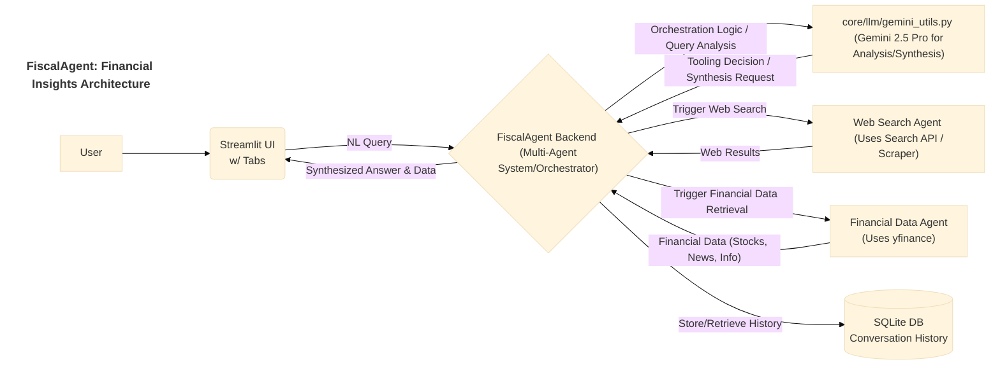

# Application Documentation: FiscalAgent - Financial Insights

**Version:** 1.0
**Parent Project:** [IntelliForge: Applied GenAI Playbook](../overview.md)
**Application Folder:** [`apps/fiscal_agent/`](../../apps/fiscal_agent/)
**App README:** [apps/fiscal_agent/README.md](../../apps/fiscal_agent/README.md)

---

## 1. Introduction

FiscalAgent is a demonstration application within the IntelliForge suite designed to showcase an **AI-powered agent** for financial analysis and insights. It simulates an assistant that can understand user queries related to finance, retrieve relevant real-time data (stock quotes, news), potentially search the web for broader context, and synthesize this information into comprehensive answers using Google's **Gemini 2.5 Pro**.

The primary goal is to illustrate how Large Language Models (LLMs) can act as orchestrators in a multi-agent system, leveraging specialized tools (like financial data APIs and web search) to gather necessary information before generating informed responses. It also demonstrates maintaining conversation history for contextual interactions.

## 2. Core AI Concept: Agentic Behavior & Tool Use

FiscalAgent primarily demonstrates:

* **Agentic Behavior:** The application acts like an intelligent agent capable of understanding goals (user queries), planning steps (deciding which tools to use), executing actions (calling APIs, searching web), and generating a final response.
* **Tool Use / Function Calling:** The core LLM (Gemini 2.5 Pro) is conceptualized as having access to specific "tools". When a query requires information beyond its internal knowledge (e.g., current stock price, latest news), the application logic (potentially guided by the LLM's analysis of the query) triggers calls to these tools (e.g., `yfinance` API, web search function).
* **LLM as Orchestrator/Synthesizer:** Gemini 2.5 Pro plays a crucial role not just in understanding the query and potentially deciding which tools to call, but also in synthesizing the information gathered from various sources (financial API, web results, conversation history) into a coherent, informative final answer.
* **Conversation Memory:** Maintaining context from previous turns in the conversation (using an SQLite database) allows for follow-up questions and more natural interactions.

## 3. Architecture & Workflow

FiscalAgent integrates a user interface, backend logic acting as an agent orchestrator, specialized data-gathering tools, and the core LLM.

1. **User Interaction:** The user interacts via a Streamlit UI (`src/app.py`), potentially using different tabs for general chat or specific stock lookups. Queries are entered in natural language.
2. **Backend Orchestration:** The application's backend (`src/`) receives the query. It analyzes the query (potentially using a preliminary call to Gemini 2.5 Pro or rule-based logic) to determine the required information and necessary tool calls.
3. **Tool Execution:**
    * **Financial Data Agent:** If stock data, company info, or specific financial news is needed, it calls functions that interact with the `yfinance` library (or similar).
    * **Web Search Agent:** If broader context or very recent information is needed, it triggers a web search function (which might use a search API or basic web scraping techniques).
4. **Information Gathering:** The results from the called tools (structured financial data, text snippets from web search) are collected.
5. **Conversation History:** Relevant parts of the conversation history are retrieved from the SQLite database (`data/conversation_history.db` or similar).
6. **LLM Synthesis:** The original query, gathered tool results, and conversation history are formatted into a prompt and sent to Gemini 2.5 Pro via `core/llm/gemini_utils.py`.
7. **Answer Display:** Gemini 2.5 Pro generates a synthesized answer, which is then displayed back to the user in the Streamlit UI. Stock charts or other structured data might also be displayed directly using libraries like Plotly.

### Architecture Diagram (Mermaid)



## 4. Key Features

* **Real-time Stock Data:** Fetches current stock prices, historical data, and generates visualizations (via `yfinance` and potentially `plotly`).
* **Company Information:** Retrieves company profiles, sector/industry details, and analyst recommendations (`yfinance`).
* **Financial News Integration:** Pulls recent news articles relevant to queried stocks or topics (`yfinance`).
* **Web Search Capability:** Supplements information with broader, real-time web search results.
* **Conversational Memory:** Remembers previous interactions in the same session for context.
* **AI-Powered Synthesis:** Uses Gemini 2.5 Pro to generate natural language summaries and analyses combining all gathered data.
* **Tabbed Interface:** Organizes functionalities for ease of use (e.g., chat vs. specific stock lookup).

## 5. Technology Stack

* **Core LLM:** Google Gemini 2.5 Pro
* **Language:** Python 3.8+
* **Web Framework:** Streamlit
* **Financial Data:** `yfinance`
* **Web Interaction:** `requests`, `beautifulsoup4` (if scraping), or a dedicated Search API wrapper library.
* **Database:** `sqlite3` (standard Python library)
* **Visualization:** `plotly` (likely dependency for charts)
* **Core Utilities:** `google-generativeai`, `python-dotenv`, `pandas` (for data handling).

## 6. Setup and Usage

*(Assumes the main project setup, including cloning and `.env` file creation, is complete.)*

1. **Navigate to App Directory:**

    ```bash
    cd path/to/IntelliForge-Applied-GenAI-Playbook/apps/fiscal_agent
    ```

2. **Create & Activate Virtual Environment (Recommended):**

    ```bash
    python -m venv venv
    source venv/bin/activate  # On Windows use `venv\Scripts\activate`
    ```

3. **Install Requirements:**
    * Create/update `apps/fiscal_agent/requirements.txt` with necessary libraries (e.g., `streamlit`, `google-generativeai`, `python-dotenv`, `yfinance`, `requests`, `beautifulsoup4`, `plotly`, `pandas`).
    * Install:

        ```bash
        pip install -r requirements.txt
        ```

4. **Run the Application:**

    ```bash
    streamlit run src/app.py
    ```

5. **Interact:**
    * Open the local URL provided by Streamlit in your browser.
    * Use the chat interface to ask financial questions (e.g., "What's the P/E ratio for GOOGL?", "Compare MSFT and AAPL performance this year", "Summarize recent news about the semiconductor industry").
    * Use dedicated tabs (if implemented) to look up specific stock tickers.
    * The application will automatically determine if it needs to fetch live data or search the web and present a synthesized answer. The conversation history is maintained per session.

## 7. Potential Future Enhancements

* Integrate more sophisticated financial analysis tools (e.g., technical indicators, fundamental ratio calculations).
* Add portfolio tracking and analysis features.
* Support for other asset classes (e.g., cryptocurrencies, bonds, commodities).
* Implement sentiment analysis on financial news.
* Allow users to configure preferred data sources or news outlets.
* Develop more robust error handling for API calls and web scraping.
* Implement caching for frequently requested static data (like company profiles).
