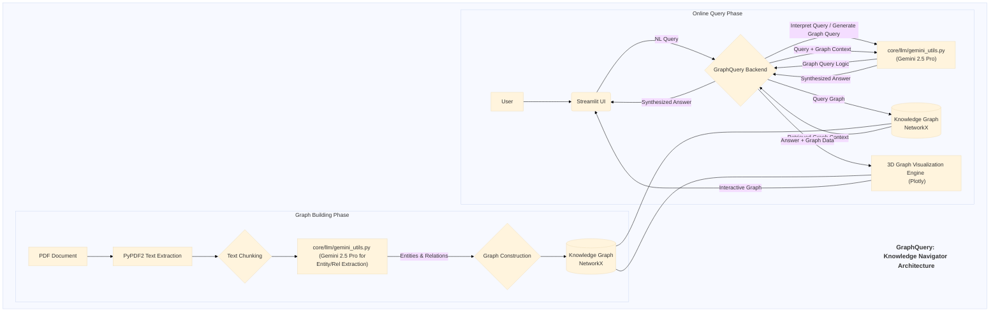

# Application Documentation: GraphQuery - Knowledge Navigator

- **Version:** 1.0
- **Parent Project:** [IntelliForge: Applied GenAI Playbook](../overview.md)
- **Application Folder:** [`apps/graph_query/`](../../apps/graph_query/)
- **App README:** [apps/graph_query/README.md](../../apps/graph_query/README.md)

---

## 1. Introduction

GraphQuery is a demonstration application within the IntelliForge suite designed to showcase the power of combining **Knowledge Graphs** with **Large Language Models (LLMs)** for information retrieval and exploration. It allows users to upload text-heavy documents (specifically PDFs in this implementation), automatically extracts key entities and their relationships to build a knowledge graph, and then enables users to query this structured knowledge using natural language.

The primary goal is to illustrate an alternative or complementary approach to standard vector-based RAG, often termed **Graph RAG**. By structuring document information as a graph, GraphQuery aims to provide insights into complex relationships and answer queries that might be difficult to address by searching through unstructured text chunks alone. The application also includes an interactive 3D visualization of the graph.

## 2. Core AI Concepts

GraphQuery primarily demonstrates:

- **Knowledge Graph Extraction:** Utilizing an LLM (Gemini 2.5 Pro) to read through text and identify:
  - **Entities:** Key nouns or concepts (e.g., people, organizations, locations, technical terms).
  - **Relationships:** The connections or interactions between these entities (e.g., "works for", "invented", "located in", "causes").
- **Knowledge Representation:** Structuring the extracted information as a graph (nodes represent entities, edges represent relationships) using a library like NetworkX.
- **Graph RAG:** Using the structured knowledge graph as the retrieval source. When a user queries, the system interprets the query, identifies relevant nodes/subgraphs within the knowledge graph, and uses this structured context to generate an answer via the LLM.
- **Natural Language Querying of Graphs:** Translating a user's natural language question into a query over the knowledge graph (this translation might involve another LLM call or specific graph traversal algorithms).
- **Data Visualization:** Representing the abstract graph structure visually and interactively (using Plotly for 3D rendering).

## 3. Architecture & Workflow

GraphQuery involves distinct phases for graph creation and querying, leveraging shared core components.

### 3.1. Graph Building Phase (Offline/Initial Processing)

This phase transforms unstructured text into a structured knowledge graph.

1. **Document Upload:** User uploads a PDF document via the Streamlit UI (`src/app.py`).
2. **Text Extraction:** The backend uses PyPDF2 (via `core/utils/data_helpers.py` or app-specific code) to extract raw text from the PDF.
3. **Text Chunking:** The extracted text might be split into smaller, manageable chunks for processing (using `core/utils/data_helpers.py`).
4. **Entity & Relationship Extraction:** Each chunk (or potentially the whole text for smaller documents) is processed by Gemini 2.5 Pro. Specific prompts guide the LLM (via `core/llm/gemini_utils.py`) to identify entities and the relationships between them, often outputting them in a structured format (e.g., triplets: `(Entity1, Relationship, Entity2)`).
5. **Graph Construction:** The extracted triplets are used to populate a NetworkX graph object. Nodes are added for entities, and directed edges are added for relationships.
6. **Graph Storage (Optional):** The constructed graph might be saved (e.g., pickled, saved as graphml) for later reuse without reprocessing the PDF.

### 3.2. Online Query Phase

This phase handles user interaction with the constructed graph.

1. **User Query:** The user enters a natural language query about the document's content via the Streamlit UI.
2. **Query Interpretation:** The backend interprets the query. This might involve:
    - Using Gemini 2.5 Pro to identify key entities or the type of information sought in the query.
    - Translating the NL query into a specific graph traversal query (e.g., find node X and its neighbors, find paths between node Y and node Z).
3. **Graph Traversal/Querying:** The backend queries the NetworkX graph based on the interpreted query, identifying relevant nodes, edges, or subgraphs.
4. **Context Formulation:** The retrieved graph information (relevant triplets or subgraph descriptions) is formatted as context.
5. **LLM Generation:** The original query and the graph-based context are sent to Gemini 2.5 Pro (via `core/llm/gemini_utils.py`) to synthesize a natural language answer.
6. **Visualization Data:** Data corresponding to the relevant subgraph is prepared for visualization.
7. **Display Results:** The generated answer and the interactive 3D graph visualization (rendered by Plotly) are displayed in the Streamlit UI.

### 3.3. Architecture Diagram (Mermaid)



## 4. Key Features

- **PDF Processing:** Extracts text directly from uploaded PDF files.
- **Automated Knowledge Graph Extraction:** Uses Gemini 2.5 Pro to build graphs from text.
- **Interactive 3D Visualization:** Provides an explorable 3D representation of the knowledge graph using Plotly.
- **Natural Language Querying:** Allows users to ask questions in plain English.
- **Relevant Subgraph Highlighting:** (Implicit via visualization) Visualizes the portion of the graph most relevant to the query.

## 5. Technology Stack

- **Core LLM:** Google Gemini 2.5 Pro
- **Language:** Python 3.8+
- **Web Framework:** Streamlit
- **PDF Processing:** `PyPDF2`
- **Graph Data Structure:** `NetworkX`
- **Graph Visualization:** `Plotly`
- **Core Utilities:** `google-generativeai`, `python-dotenv`, `pandas` (potentially for handling extracted triplets).

## 6. Setup and Usage

*(Assumes the main project setup, including cloning and `.env` file creation, is complete as described in the main project [README](../../README.md) or [Overview](../overview.md).)*

1. **Navigate to App Directory:**

    ```bash
    cd path/to/IntelliForge-Applied-GenAI-Playbook/apps/graph_query
    ```

2. **Create & Activate Virtual Environment (Recommended):**

    ```bash
    python -m venv venv
    source venv/bin/activate  # On Windows use `venv\Scripts\activate`
    ```

3. **Install Requirements:**
    - Create/update `apps/graph_query/requirements.txt` with necessary libraries (e.g., `streamlit`, `google-generativeai`, `python-dotenv`, `PyPDF2`, `networkx`, `plotly`).
    - Install:

        ```bash
        pip install -r requirements.txt
        ```

4. **Run the Application:**

    ```bash
    streamlit run src/app.py
    ```

5. **Interact:**
    - Open the local URL provided by Streamlit in your browser.
    - Use the file uploader to select a PDF document.
    - Click the button to trigger the entity/relationship extraction and graph building process (this may take some time depending on document size and LLM response time).
    - Once the graph is built, explore the 3D visualization.
    - Enter natural language queries related to the document content in the query input box.
    - View the generated answer and observe how the relevant part of the graph might be highlighted or focused upon in the visualization.

## 7. Potential Future Enhancements

- Support for more document types (DOCX, TXT, HTML).
- More sophisticated entity linking and resolution (linking "IBM" and "International Business Machines").
- Ability to merge graphs from multiple documents.
- Advanced graph querying capabilities (e.g., using Cypher-like queries generated by the LLM).
- Integration with external knowledge bases (e.g., Wikidata) to enrich the graph.
- Implement graph persistence to save and load pre-built graphs.
- Fine-tuning the prompt for more accurate or specific types of relationship extraction.
