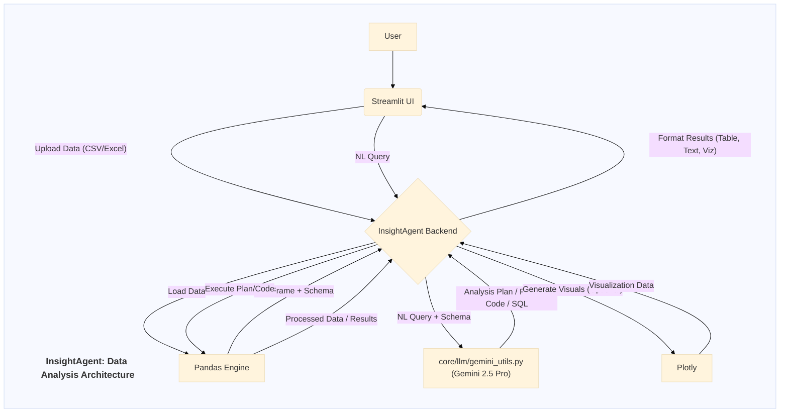

# Application Documentation: InsightAgent - Data Analysis

- **Version:** 1.0
- **Parent Project:** [IntelliForge: Applied GenAI Playbook](../overview.md)
- **Application Folder:** [`apps/insight_agent/`](../../apps/insight_agent/)
- **App README:** [apps/insight_agent/README.md](../../apps/insight_agent/README.md)

---

## 1. Introduction

InsightAgent is a demonstration application within the IntelliForge suite designed to simplify data analysis by providing a **natural language interface** to tabular datasets. Users can upload their data in common formats (CSV, Excel) and ask questions about it in plain English. The application leverages Google's **Gemini 2.5 Pro** to understand the user's query, potentially generate the corresponding SQL query or directly formulate an analysis plan, execute the analysis using Pandas, and present the results or visualizations back to the user.

The primary goal is to showcase how LLMs can act as an intelligent layer between users and their data, lowering the barrier to data exploration and insight generation, especially for users who may not be proficient in SQL or data analysis libraries like Pandas.

## 2. Core AI Concept: Natural Language Interface to Data

InsightAgent primarily demonstrates:

- **Natural Language Understanding (NLU):** Utilizing Gemini 2.5 Pro to interpret the user's question asked in everyday language.
- **Schema Understanding:** The LLM needs to understand the structure (columns, data types) of the uploaded dataset to formulate valid queries or analysis plans. (This usually involves passing the schema information within the prompt).
- **Code Generation (NL2SQL/NL2Pandas):** A key capability is translating the natural language query into executable code. This could be:
  - **NL2SQL:** Generating a SQL query that can be run against the data (if loaded into an in-memory SQL engine like DuckDB or SQLite).
  - **NL2Pandas:** Directly generating Python code using the Pandas library to perform the requested analysis on the DataFrame.
- **Reasoning and Analysis Planning:** For more complex queries, the LLM might generate a multi-step plan rather than a single query, outlining how to arrive at the answer.
- **Insight Synthesis:** Using the LLM to summarize the results of the analysis in natural language.

## 3. Architecture & Workflow

InsightAgent facilitates a straightforward workflow from data upload to insight generation:

1. **Data Upload:** User uploads a CSV or Excel file via the Streamlit UI (`src/app.py`, using `core/utils/file_io.py`).
2. **Data Loading:** The backend loads the uploaded file into a Pandas DataFrame using `pandas` (potentially via `core/utils/data_helpers.py`). The DataFrame's schema (column names, data types) is extracted.
3. **User Query:** The user enters a natural language question about the data in the Streamlit UI.
4. **LLM Interaction:**
    - The backend constructs a prompt containing the user's query, the DataFrame schema, and potentially some sample data rows.
    - This prompt is sent to Gemini 2.5 Pro via `core/llm/gemini_utils.py`.
    - Gemini processes the prompt and generates executable code (SQL or Pandas) or an analysis plan.
5. **Code Execution / Analysis:**
    - If SQL is generated, it might be executed against the DataFrame using a library like `pandasql` or an in-memory DB.
    - If Pandas code is generated, it is executed directly on the DataFrame.
    - If a plan is generated, the steps are executed sequentially.
6. **Result Processing:** The results of the execution (e.g., a filtered DataFrame, aggregated statistics, calculated values) are obtained.
7. **Visualization (Optional):** If the query implies visualization, the backend uses a library like Plotly to generate charts based on the results.
8. **Insight Generation (Optional):** The results might be sent back to Gemini 2.5 Pro for summarization into natural language insights.
9. **Display Results:** The generated code (SQL/Pandas), analysis results (tables, values), natural language insights, and visualizations are displayed back to the user in the Streamlit UI (using `core/utils/ui_helpers.py`).

### Architecture Diagram (Mermaid)



## 4. Key Features

- **File Upload:** Supports CSV and Excel file formats.
- **Natural Language Querying:** Allows users to ask data-related questions naturally.
- **Code Generation:** Automatically generates Pandas code or SQL queries.
- **Interactive Data Display:** Shows the uploaded data in a navigable table.
- **Analysis Execution:** Runs the generated code to perform the analysis.
- **Result Visualization:** (Potential Feature) Generates charts and graphs using Plotly.
- **Insight Summarization:** (Potential Feature) Uses LLM to summarize findings.

## 5. Technology Stack

- **Core LLM:** Google Gemini 2.5 Pro
- **Language:** Python 3.8+
- **Web Framework:** Streamlit
- **Data Handling:** `pandas`, `numpy`
- **Visualization:** `plotly` (optional, for charts)
- **SQL Execution (Optional):** `pandasql`, `duckdb`, or `sqlite3`
- **Core Utilities:** `google-generativeai`, `python-dotenv`.

## 6. Setup and Usage

*(Assumes the main project setup, including cloning and `.env` file creation, is complete as described in the main project [README](../../README.md) or [Overview](../overview.md).)*

1. **Navigate to App Directory:**

    ```bash
    cd path/to/IntelliForge-Applied-GenAI-Playbook/apps/insight_agent
    ```

2. **Create & Activate Virtual Environment (Recommended):**

    ```bash
    python -m venv venv
    source venv/bin/activate  # On Windows use `venv\Scripts\activate`
    ```

3. **Install Requirements:**
    - Create/update `apps/insight_agent/requirements.txt` with necessary libraries (e.g., `streamlit`, `google-generativeai`, `python-dotenv`, `pandas`, `numpy`, `openpyxl` or `xlrd` for Excel, potentially `plotly`, `pandasql`).
    - Install:

        ```bash
        pip install -r requirements.txt
        ```

4. **Run the Application:**

    ```bash
    streamlit run src/app.py
    ```

5. **Interact:**
    - Open the local URL provided by Streamlit in your browser.
    - Use the file uploader in the sidebar (or main page) to select a CSV or Excel file.
    - Once the data is loaded and displayed, enter a question about the data in the query input field (e.g., "What is the average value in the 'Sales' column?", "Show rows where 'Region' is 'North'", "Plot 'Revenue' over 'Date'").
    - Submit the query.
    - View the generated code (optional display), the results table or value, and any generated visualizations or insights.

## 7. Potential Future Enhancements

- Support for connecting directly to databases instead of only file uploads.
- More sophisticated visualization options and chart type suggestions by the LLM.
- Ability to handle multi-turn conversations for iterative analysis.
- Caching of results for repeated queries.
- Generation of full data analysis reports, not just answers to specific questions.
- Improved error handling for generated code execution.
- Allowing users to edit the generated code before execution.
