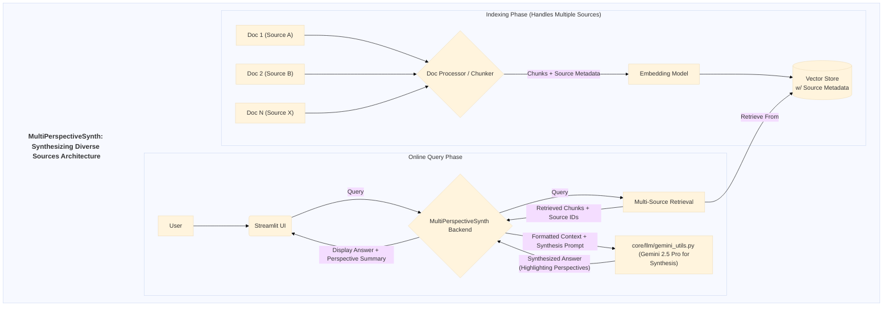

# Application Documentation: MultiPerspectiveSynth - Synthesizing Diverse Sources

- **Version:** 1.0
- **Parent Project:** [IntelliForge: Applied GenAI Playbook](../overview.md)
- **Application Folder:** [`apps/multi_perspective_synth/`](../../apps/multi_perspective_synth/)
- **App README:** [apps/multi_perspective_synth/README.md](../../apps/multi_perspective_synth/README.md)

---

## 1. Introduction

MultiPerspectiveSynth is a demonstration application within the IntelliForge suite focusing on an advanced **Retrieval-Augmented Generation (RAG)** challenge: synthesizing information from multiple documents that may present **diverse or even conflicting viewpoints** on a single topic. Standard RAG often implicitly assumes a homogeneous knowledge base, but real-world scenarios frequently involve analyzing information from various sources.

This application allows users to upload multiple documents potentially representing different perspectives. When queried, it retrieves relevant information from across these sources and uses Google's **Gemini 2.5 Pro**, with specialized prompting, to generate a nuanced answer that explicitly **acknowledges and synthesizes** these differing viewpoints, highlighting areas of consensus and contention.

The goal is to showcase how RAG systems can be designed to handle information diversity and provide more comprehensive, balanced summaries.

## 2. Core AI Concept: Multi-Source Synthesis & Perspective Handling

MultiPerspectiveSynth demonstrates:

- **Multi-Source RAG:** Performing retrieval across a corpus explicitly known to contain documents from potentially different sources (tracking provenance is key).
- **Perspective Identification (Implicit/Explicit):** Identifying that retrieved context chunks come from sources with potentially differing views (using metadata or LLM analysis).
- **LLM as Synthesizer:** Prompting Gemini 2.5 Pro specifically to analyze the combined context for variations, agreement, and disagreement, and reflect this in the output.
- **Balanced Representation:** Aiming to fairly represent key viewpoints found in the retrieved context.
- **Source Attribution:** Potentially indicating which source supports which part of the synthesized answer.

## 3. Architecture & Workflow

This application modifies the standard RAG flow to handle multiple sources and perform synthesis explicitly.

### 3.1. Pre-computation/Indexing

Indexing needs to store source information alongside chunks:

1. **Document Loading (Multi-Source):** Load documents, associating each with a source identifier (`core/utils/data_helpers.py`).
2. **Text Chunking:** Standard chunking.
3. **Metadata Association:** Ensure chunk metadata includes source ID.
4. **Embedding & Indexing:** Store chunks + metadata (including source ID) in vector store (`core/utils/retrieval_utils.py`).

### 3.2. Online Query Flow

1. **User Query:** User submits query via Streamlit UI (`src/app.py`).
2. **Multi-Source Retrieval:** Retrieve relevant chunks (with source IDs) from the indexed corpus (`core/utils/retrieval_utils.py`).
3. **Context Formulation:** Format retrieved text chunks and their source identifiers.
4. **Synthesis Prompting:** Construct a specialized prompt instructing Gemini 2.5 Pro to answer, identify perspectives, highlight agreement/disagreement, and synthesize viewpoints.
5. **LLM Synthesis Call:** Send prompt to Gemini 2.5 Pro (via `core/llm/gemini_utils.py`).
6. **Result Generation:** LLM generates the synthesized answer.
7. **Display Results:** Display the nuanced answer in Streamlit UI, possibly summarizing perspectives or conflicting points.

### 3.3. Architecture Diagram (Mermaid)



## 4. Key Features

(Remains the same: Handles Multiple Docs, Perspective Synthesis, Highlights Agreement/Disagreement, Balanced Answers, Source Awareness)

## 5. Technology Stack

- **Core LLM:** Google Gemini 2.5 Pro
- **Language:** Python 3.8+
- **Web Framework:** Streamlit
- **Retrieval:** Vector DB (e.g., ChromaDB supporting metadata), Embedding Models via `core/utils/retrieval_utils.py`.
- **Core Utilities:** `google-generativeai`, `python-dotenv`, `pandas`.

## 6. Setup and Usage

*(Assumes the main project setup is complete.)*

1. **Navigate to App Directory:**

    ```bash
    cd path/to/IntelliForge-Applied-GenAI-Playbook/apps/multi_perspective_synth
    ```

2. **Create & Activate Virtual Environment (Recommended).**

3. **Install Requirements:**
    - Create/update `apps/multi_perspective_synth/requirements.txt` (e.g., `streamlit`, `google-generativeai`, `python-dotenv`, `chromadb-client`, etc.).
    - Install: `pip install -r requirements.txt`

4. **Prepare Data & Indexes:**
    - Place the multiple source documents (e.g., PDFs, TXTs) in `apps/multi_perspective_synth/data/`.
    - Run the necessary indexing process (using shared utils), ensuring source metadata is associated with chunks in the vector store.

5. **Run the Application:**

    ```bash
    streamlit run src/app.py
    ```

    *(Assuming the main application file is `src/app.py`)*

6. **Interact:**
    - Open the local URL provided by Streamlit.
    - Ensure the multi-source documents have been indexed.
    - Enter a query likely to elicit different responses based on the sources.
    - Observe the generated answer, noting how it attempts to present different viewpoints or explicitly mentions agreement/disagreement.

## 7. Potential Future Enhancements

(Remains the same: Explicit stance detection, User tagging, Viz perspectives, Granular source attribution, Source filtering, Compare synthesis prompts)
