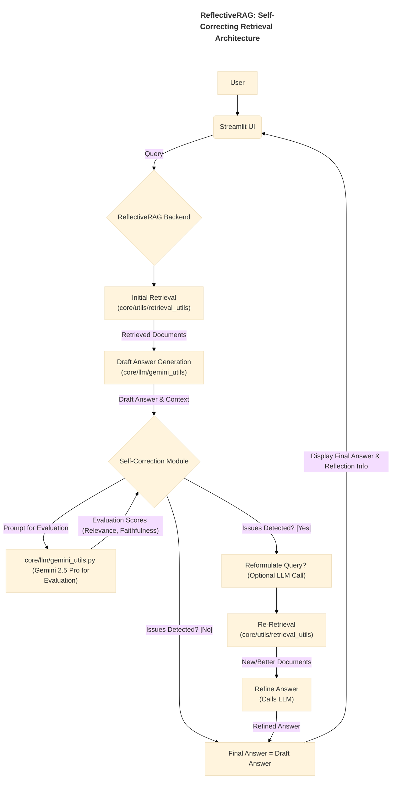

# Application Documentation: ReflectiveRAG - Self-Correcting Retrieval

- **Version:** 1.0
- **Parent Project:** [IntelliForge: Applied GenAI Playbook](../overview.md)
- **Application Folder:** [`apps/reflective_rag/`](../../apps/reflective_rag/)
- **App README:** [apps/reflective_rag/README.md](../../apps/reflective_rag/README.md)

---

## 1. Introduction

ReflectiveRAG is an advanced demonstration application within the IntelliForge suite designed to showcase an **Enhanced Retrieval-Augmented Generation (RAG)** technique incorporating **self-correction and reflection**. Standard RAG retrieves context and generates an answer, but ReflectiveRAG adds intermediate steps where the system critically evaluates its own process using Google's **Gemini 2.5 Pro**.

The primary goal is to illustrate how adding reflective capabilities can improve the robustness, accuracy, and faithfulness of RAG systems. By identifying potential issues like irrelevant retrieved context or generated answers that hallucinate or contradict the source material *before* presenting the result, the system can attempt to correct its course, leading to higher-quality outputs. This demo aims to make this internal "thinking" process more transparent.

## 2. Core AI Concept: Reflection and Self-Correction in RAG

ReflectiveRAG demonstrates:

- **Multi-Step Reasoning:** The RAG process is broken down into more discrete steps (retrieve, draft, evaluate, potentially refine).
- **LLM as Evaluator:** Gemini 2.5 Pro is used not only for the final answer generation but also for intermediate **evaluation tasks**. Specific prompts are designed to make the LLM assess:
  - **Context Relevance:** How well do the retrieved document chunks actually address the user's query?
  - **Answer Faithfulness (Groundedness):** Does the generated draft answer accurately reflect the information present *only* in the provided context chunks, or does it introduce external information or contradictions?
- **Conditional Workflow:** The RAG pipeline is no longer strictly linear. Based on the outcome of the evaluation step, the system can conditionally trigger corrective actions:
  - **Query Reformulation:** If context relevance is low, the LLM might be prompted to rewrite the original query to be more effective for retrieval.
  - **Re-Retrieval:** Using the reformulated query or adjusted parameters to fetch a new set of context documents.
  - **Answer Refinement:** Regenerating the answer based on improved context or explicitly instructing the LLM to fix faithfulness issues identified during evaluation.
- **Iterative Improvement:** The reflection loop could potentially run multiple times (though this demo might implement a single correction step for simplicity) until evaluation scores meet a certain threshold or a maximum number of attempts is reached.

## 3. Architecture & Workflow

ReflectiveRAG builds upon standard RAG components but inserts a critical evaluation and potential correction loop.

### 3.1. Pre-computation/Indexing

Similar to ContextQuest, this application requires an initial indexing phase (typically run offline or upon data setup) using shared utilities:

1. **Document Loading & Chunking:** (`core/utils/data_helpers.py`)
2. **Embedding Generation:** (`core/utils/retrieval_utils.py`)
3. **Vector Store Indexing:** (`core/utils/retrieval_utils.py`)

### 3.2. Online Query Flow (with Reflection Loop)

1. **User Query:** User submits a query via the Streamlit UI (`src/app.py`).
2. **Initial Retrieval:** The backend performs a standard retrieval (e.g., vector search) using `core/utils/retrieval_utils.py` to get relevant document chunks.
3. **Draft Answer Generation:** The query and retrieved context are sent to Gemini 2.5 Pro (via `core/llm/gemini_utils.py`) to generate a *draft* answer.
4. **Self-Correction / Reflection Module:** This is the core of ReflectiveRAG.
    - **Prepare Evaluation Prompts:** Prompts are constructed to ask Gemini to evaluate (a) the relevance of the retrieved chunks to the original query, and (b) the faithfulness of the draft answer to *only* the provided chunks. These might leverage functions from `core/utils/evaluation.py`.
    - **LLM Evaluation Calls:** One or more calls are made to Gemini 2.5 Pro (via `core/llm/gemini_utils.py`) using the evaluation prompts. The LLM might return scores, critiques, or boolean flags.
5. **Decision Point:** Based on the evaluation results:
    - **If OK:** The draft answer is deemed acceptable and becomes the final answer.
    - **If Not OK (Needs Correction):**
        - **(Optional) Query Reformulation:** If context relevance is low, another LLM call might generate a better query.
        - **Re-Retrieval:** Perform retrieval again using the (potentially reformulated) query via `core/utils/retrieval_utils.py`.
        - **Answer Refinement:** Generate a *new* answer using the original query and the *new* context (or the original context but with specific instructions to fix faithfulness issues) via `core/llm/gemini_utils.py`. This refined answer becomes the final answer.
6. **Display Results:** The final answer, along with optional insights into the reflection process (e.g., evaluation scores, whether re-retrieval occurred), is displayed in the Streamlit UI.

### 3.3. Architecture Diagram (Mermaid)



## 4. Key Features

- **Self-Evaluation:** LLM assesses the quality of its own intermediate retrieval and generation steps.
- **Context Relevance Check:** Explicitly verifies if retrieved documents align with the query intent.
- **Answer Faithfulness Check:** Mitigates hallucinations by ensuring the answer is grounded in the provided context.
- **Automated Correction:** Conditionally triggers query reformulation, re-retrieval, or answer refinement.
- **Transparency (Potential UI Feature):** Aims to visualize or report the reflection process (e.g., evaluation scores, actions taken).

## 5. Technology Stack

- **Core LLM:** Google Gemini 2.5 Pro
- **Language:** Python 3.8+
- **Web Framework:** Streamlit
- **Retrieval:** Vector DB (e.g., ChromaDB), Embedding Models (e.g., `text-embedding-004`) via `core/utils/retrieval_utils.py`.
- **Evaluation Logic:** Prompts and potentially parsing functions within the app or `core/utils/evaluation.py`.
- **Core Utilities:** `google-generativeai`, `python-dotenv`, `pandas` (for data handling).

## 6. Setup and Usage

*(Assumes the main project setup is complete.)*

1. **Navigate to App Directory:**

    ```bash
    cd path/to/IntelliForge-Applied-GenAI-Playbook/apps/reflective_rag
    ```

2. **Create & Activate Virtual Environment (Recommended).**

3. **Install Requirements:**
    - Create/update `apps/reflective_rag/requirements.txt` (e.g., `streamlit`, `google-generativeai`, `python-dotenv`, `chromadb-client`, etc.).
    - Install: `pip install -r requirements.txt`

4. **Prepare Data & Indexes:**
    - Place source documents in `apps/reflective_rag/data/`.
    - Run the necessary indexing process (using shared utils) to populate the vector store.

5. **Run the Application:**

    ```bash
    streamlit run src/app.py
    ```

6. **Interact:**
    - Open the local URL provided by Streamlit.
    - Enter a query related to the indexed documents.
    - Observe the final answer. The UI might optionally display information about the reflection process (e.g., "Initial context relevance: Low. Reformulating query...", "Answer faithfulness check passed.").

## 7. Potential Future Enhancements

- Implement multi-step reflection loops.
- Allow user configuration of evaluation thresholds or correction strategies.
- More detailed visualization of the correction steps in the UI.
- Integrate feedback mechanisms where users can rate the quality of the final answer or the reflection process itself.
- Experiment with different evaluation prompting techniques.
- Use specialized smaller models for evaluation tasks if cost/latency is a concern.
