# Application Documentation: ToolAugmentedRAG - Retrieval + Live Data Integration

- **Version:** 1.0
- **Parent Project:** [IntelliForge: Applied GenAI Playbook](../overview.md)
- **Application Folder:** [`apps/tool_augmented_rag/`](../../apps/tool_augmented_rag/)
- **App README:** [apps/tool_augmented_rag/README.md](../../apps/tool_augmented_rag/README.md)

---

## 1. Introduction

ToolAugmentedRAG is a demonstration application within the IntelliForge suite that illustrates how to enhance **Retrieval-Augmented Generation (RAG)** systems by integrating them with **external tools and APIs**. Standard RAG retrieves information from a static knowledge base, which may lack real-time information. This application addresses that limitation by enabling the system to dynamically fetch live data (e.g., current stock prices, weather forecasts, web search results) when the query requires it.

The application uses Google's **Gemini 2.5 Pro** not only to generate the final answer but also potentially to understand when a query necessitates calling an external tool, selecting the appropriate tool, and then synthesizing information from *both* the static RAG context *and* the live tool output.

The goal is to showcase a powerful RAG pattern that provides comprehensive, up-to-date answers by bridging internal knowledge and the dynamic external world.

## 2. Core AI Concept: RAG with Tool Use (Agentic RAG)

ToolAugmentedRAG primarily demonstrates:

- **Standard RAG:** Baseline retrieval from an indexed static document store.
- **Tool Use / Function Calling:** Accessing predefined "tools" (functions interacting with external APIs like `yfinance`, weather, search).
- **Agentic Decision Making:** Logic (potentially LLM-guided) to determine if external info/tools are needed based on the query.
- **Information Synthesis:** Combining context from static RAG and live tool outputs using Gemini 2.5 Pro.
- **Contextual Tool Invocation:** Calling tools based on query context.

## 3. Architecture & Workflow

This application adds a conditional tool-use layer to the RAG workflow.

### 3.1. Pre-computation/Indexing

Standard indexing phase for the static knowledge base:

1. **Document Loading & Chunking:** (`core/utils/data_helpers.py`)
2. **Embedding Generation:** (`core/utils/retrieval_utils.py`)
3. **Vector Store Indexing:** (`core/utils/retrieval_utils.py`)

### 3.2. Online Query Flow

1. **User Query:** User submits query via Streamlit UI (`src/app.py`).
2. **Initial RAG Retrieval:** Retrieve baseline context from static store (`core/utils/retrieval_utils.py`).
3. **Tool Use Decision:** Analyze query (and maybe initial context) to determine if tools are needed and which ones (Rule-based or LLM call via `core/llm/gemini_utils.py`).
4. **Conditional Tool Execution:** If needed, call the corresponding tool function(s) (e.g., `yfinance`, weather API, web search API/`crawl4ai`).
5. **Context Aggregation:** Combine static context and live tool results.
6. **Final Answer Synthesis:** Send combined context and query to Gemini 2.5 Pro (via `core/llm/gemini_utils.py`) for synthesis.
7. **Display Results:** Show the synthesized answer in the UI, possibly indicating tools used.

### 3.3. Architecture Diagram (Mermaid)

```mermaid
%%{init: {'theme': 'base', 'themeVariables': { 'titleColor': '#333', 'titleFontSize': '20px'}}}%%
graph TD
    subgraph " "
            %% Title Definition
            classDef titleClass fill:none,stroke:none,color:#333,font-size:18px,font-weight:bold;
            title["ToolAugmentedRAG: Retrieval + Live Data Integration Architecture"]:::titleClass;

            subgraph Main_Workflow ["Main Workflow"]
                A[User] --> B(Streamlit UI);
                B -- Query --> C{ToolAugmentedRAG Backend};

                %% Static Retrieval Path
                C --> D["Static Document Retrieval <br> (core/utils/retrieval_utils)"];
                D -- Static Context --> F{Data Integrator / Context Aggregator};

                %% Tool Decision Path
                C -- Analyze Query --> G["Tool Detector / Router <br> (Logic or LLM Call)"];
                G -- Determine Tool Needs --> H["core/llm/gemini_utils.py <br> (Gemini 2.5 Pro for Decision/Synthesis)"];
                H -- Tool Decision --> G;

                %% Tool Execution Path (Conditional)
                G -- Tool(s) Needed? |Yes| --> I{Tool Executor};
                subgraph External_Tools_APIs ["External Tools / APIs"]
                    direction LR
                    J["Stock Price API <br> (yfinance)"]
                    K[Weather API]
                    L["Web Search API <br> (Search / crawl4ai)"]
                end
                I -- Trigger Tool --> J;
                I -- Trigger Tool --> K;
                I -- Trigger Tool --> L;
                External_Tools_APIs -- Live Data / Tool Results --> I;
                I -- Live Data Results --> F;
                %% Path if no tool is needed
                G -- Tool(s) Needed? |No| --> F;

                %% Final Synthesis
                F -- Combined Context (Static + Live) --> M[Answer Synthesis Module];
                M -- Query + Combined Context --> H;
                H -- Synthesized Final Answer --> M;
                M -- Final Answer --> C;
                C -- Display Final Answer + Tool Info --> B;

                %% Connect Static Store
                subgraph Static_KB ["Static Knowledge Base"]
                    E[(Document Vector Store)]
                end
                D -- Retrieve From --> E;
            end

            %% Add invisible link from title to the topmost node (User)
            title ~~~ A;

    end
```



## 4. Key Features

(Remains the same: Blends Static & Live Data, Automated Tool Selection, API Integration Examples, Comprehensive Answers, Agentic Capability)

## 5. Technology Stack

- **Core LLM:** Google Gemini 2.5 Pro
- **Language:** Python 3.8+
- **Web Framework:** Streamlit
- **Static Retrieval:** Vector DB (e.g., ChromaDB), Embedding Models via `core/utils/retrieval_utils.py`.
- **Tool APIs:** `yfinance` (Stocks), `requests` (Weather etc.), Search Wrappers or **`crawl4ai`**.
- **Core Utilities:** `google-generativeai`, `python-dotenv`, `pandas`.

## 6. Setup and Usage

*(Assumes the main project setup, including cloning and `.env` file creation, is complete as described in the main project [README](../../README.md) or [Overview](../overview.md).)*

1. **Navigate to App Directory:**

    ```bash
    cd path/to/IntelliForge-Applied-GenAI-Playbook/apps/tool_augmented_rag
    ```

2. **Create & Activate Virtual Environment (Recommended).**

3. **Install Requirements:**
    - Create/update `apps/tool_augmented_rag/requirements.txt` (e.g., `streamlit`, `google-generativeai`, `python-dotenv`, `chromadb-client`, `yfinance`, `requests`, potentially `crawl4ai`, etc.).
    - Install: `pip install -r requirements.txt`

4. **API Keys:** Configure Google API Key in `.env`. Note that *external tools* (weather, specific search APIs) might require their own keys added to `.env`.

5. **Prepare Data & Indexes:**
    - Place static documents in `apps/tool_augmented_rag/data/`.
    - Run the indexing process (using shared utils) for the static documents.

6. **Run the Application:**

    ```bash
    streamlit run src/app.py
    ```

    *(Assuming the main application file is `src/app.py`)*

7. **Interact:**
    - Open the local URL.
    - Enter queries. Try some needing live data ("current weather in...", "latest stock price for...") alongside static queries.
    - Observe responses, noting if tools were invoked and how information is combined.

## 7. Potential Future Enhancements

(Remains the same: More tools, Sophisticated tool selection, Multi-step tools, Error handling, Caching, User tool config, LLM function calling)
- **Explicit crawl4ai integration:** If enhancing web search, make this a clear configuration option or default.
