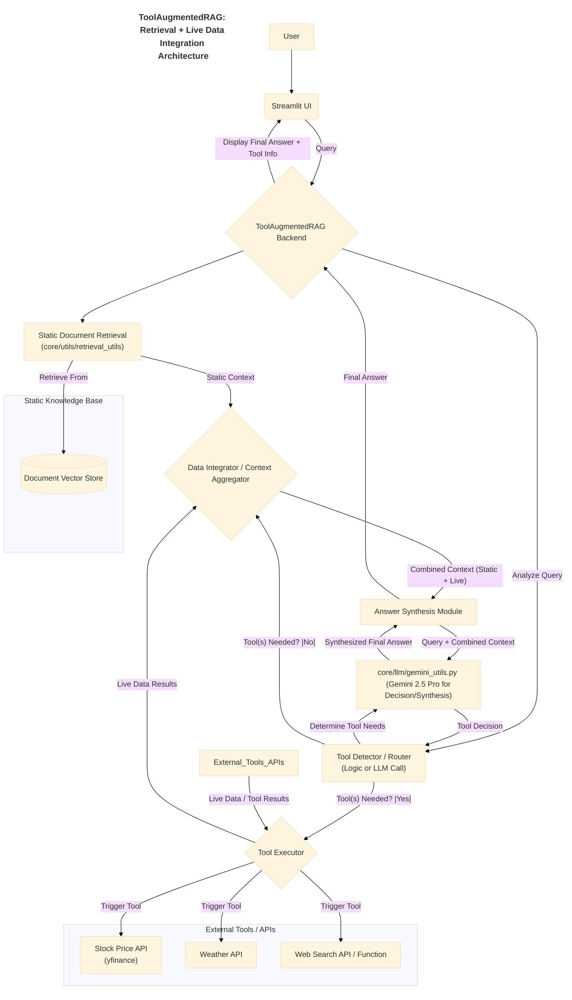

# Application Documentation: ToolAugmentedRAG - Retrieval + Live Data Integration

**Version:** 1.0
**Parent Project:** [IntelliForge: Applied GenAI Playbook](../overview.md)
**Application Folder:** [`apps/tool_augmented_rag/`](../../apps/tool_augmented_rag/)
**App README:** [apps/tool_augmented_rag/README.md](../../apps/tool_augmented_rag/README.md)

---

## 1. Introduction

ToolAugmentedRAG is a demonstration application within the IntelliForge suite that illustrates how to enhance **Retrieval-Augmented Generation (RAG)** systems by integrating them with **external tools and APIs**. Standard RAG retrieves information from a static knowledge base, which may become outdated or lack real-time information. This application addresses that limitation by enabling the system to dynamically fetch live data (e.g., current stock prices, weather forecasts, latest web search results) when the user's query requires it.

The application uses Google's **Gemini 2.5 Pro** not only to generate the final answer but also potentially to understand when a query necessitates calling an external tool, selecting the appropriate tool, and then synthesizing information from *both* the static RAG context *and* the live tool output.

The goal is to showcase a more powerful and versatile RAG pattern that can provide comprehensive, up-to-date answers by bridging the gap between internal knowledge and the dynamic external world.

## 2. Core AI Concept: RAG with Tool Use (Agentic RAG)

ToolAugmentedRAG primarily demonstrates:

* **Standard RAG:** As a baseline, it performs retrieval from an indexed static document store.
* **Tool Use / Function Calling:** The system has access to a predefined set of "tools" (functions that interact with external APIs like `yfinance`, weather services, or search engines).
* **Agentic Decision Making:** The core logic, potentially guided by an initial LLM call (using Gemini 2.5 Pro), analyzes the user query to determine:
    1. Is the answer likely contained within the static documents?
    2. Does the query explicitly or implicitly require real-time or external information?
    3. If external information is needed, which specific tool(s) should be called?
* **Information Synthesis:** The crucial step where the LLM (Gemini 2.5 Pro) combines potentially disparate pieces of information – structured data from APIs, text snippets from web searches, and context chunks from static documents – into a single, coherent natural language answer.
* **Contextual Tool Invocation:** Tools are not called arbitrarily but invoked based on the context of the user's query.

## 3. Architecture & Workflow

This application adds a conditional tool-use layer to the standard RAG workflow.

### 3.1. Pre-computation/Indexing

Requires the standard indexing phase for the static knowledge base:

1. **Document Loading & Chunking:** (`core/utils/data_helpers.py`)
2. **Embedding Generation:** (`core/utils/retrieval_utils.py`)
3. **Vector Store Indexing:** (`core/utils/retrieval_utils.py`)

### 3.2. Online Query Flow

1. **User Query:** User submits a query via the Streamlit UI (`src/app.py`).
2. **Initial RAG Retrieval:** The backend performs standard retrieval from the static document store (e.g., vector search) via `core/utils/retrieval_utils.py`. This provides baseline context.
3. **Tool Use Decision Module:**
    * The backend analyzes the user query (and potentially the initially retrieved context). This might involve rules-based logic (e.g., keywords like "current stock price", "weather in...") or an LLM call (Gemini 2.5 Pro via `core/llm/gemini_utils.py`) prompted to determine if any predefined tools are needed and which ones.
4. **Conditional Tool Execution:**
    * If the decision module determines a tool is needed, the backend calls the corresponding function (e.g., fetch stock data using `yfinance`, call weather API, perform web search using `requests` or a dedicated library).
    * The results from the tool(s) are collected (e.g., current price, temperature, search snippets).
5. **Context Aggregation / Data Integration:** The backend combines:
    * The context retrieved from the static RAG step.
    * The data retrieved from any executed external tools.
6. **Final Answer Synthesis:** A consolidated prompt containing the original query, the static context, and the live tool results is sent to Gemini 2.5 Pro (via `core/llm/gemini_utils.py`), instructing it to synthesize all available information into a comprehensive answer.
7. **Display Results:** The final, synthesized answer, possibly indicating which tools were used or displaying the raw tool output alongside, is shown in the Streamlit UI.

### 3.3. Architecture Diagram (Mermaid)



## 4. Key Features

* **Blends Static & Live Data:** Combines information from a fixed knowledge base with real-time external sources.
* **Automated Tool Selection:** Intelligently determines when to call external tools based on the query.
* **API Integration Examples:** Demonstrates connections to common APIs (finance, weather, search).
* **Comprehensive Answers:** Provides more complete and up-to-date responses than standard RAG alone.
* **Agentic Capability:** Shows the LLM acting as part of an agent that can perceive (query), reason (decide tool use), and act (call APIs).

## 5. Technology Stack

* **Core LLM:** Google Gemini 2.5 Pro
* **Language:** Python 3.8+
* **Web Framework:** Streamlit
* **Static Retrieval:** Vector DB (e.g., ChromaDB), Embedding Models via `core/utils/retrieval_utils.py`.
* **Tool APIs:** `yfinance` (Stocks), `requests` (for generic APIs like weather, search), potentially dedicated search libraries (e.g., `google-api-python-client`, `duckduckgo_search`).
* **Core Utilities:** `google-generativeai`, `python-dotenv`, `pandas`.

## 6. Setup and Usage

*(Assumes the main project setup is complete.)*

1. **Navigate to App Directory:**

    ```bash
    cd path/to/IntelliForge-Applied-GenAI-Playbook/apps/tool_augmented_rag
    ```

2. **Create & Activate Virtual Environment (Recommended).**

3. **Install Requirements:**
    * Create/update `apps/tool_augmented_rag/requirements.txt` (e.g., `streamlit`, `google-generativeai`, `python-dotenv`, `chromadb-client`, `yfinance`, `requests`, etc.).
    * Install: `pip install -r requirements.txt`

4. **API Keys (External Tools):** Note that besides the Google API key, some external tools (like specific weather or search APIs) might require their *own* API keys. These would also need to be configured, likely via the `.env` file or environment variables.

5. **Prepare Data & Indexes:**
    * Place source documents for the static knowledge base in `apps/tool_augmented_rag/data/`.
    * Run the necessary indexing process (using shared utils) to populate the vector store.

6. **Run the Application:**

    ```bash
    streamlit run src/app.py
    ```

7. **Interact:**
    * Open the local URL provided by Streamlit.
    * Enter queries. Try queries that obviously need live data (e.g., "What is the current weather in London?", "What is the latest stock price for TSLA based on this report?") alongside queries answerable from static docs.
    * Observe how the system responds. For queries requiring live data, the UI might indicate which tool was called, and the final answer should incorporate the fresh information alongside any relevant context from the static documents.

## 7. Potential Future Enhancements

* Add more tools (e.g., calendar access, database query tool, code execution).
* Implement more sophisticated tool selection logic (e.g., LLM choosing from a larger tool list).
* Handle tools that require multiple steps or user interaction.
* Improve error handling for failed API calls.
* Implement caching for tool results where appropriate (e.g., cache weather for a short period).
* Allow users to dynamically add or configure available tools.
* Explore LLM function calling capabilities provided directly by the Gemini API for more structured tool interaction.
