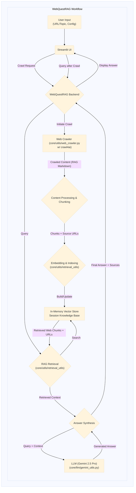

# Application Documentation: WebQuestRAG - Dynamic Web RAG Agent

- **Version:** 1.0
- **Parent Project:** [IntelliForge: Applied GenAI Playbook](../overview.md)
- **Application Folder:** [`apps/web_quest_rag/`](../../apps/web_quest_rag/)
- **App README:** [apps/web_quest_rag/README.md](../../apps/web_quest_rag/README.md)

---

## 1. Introduction

WebQuestRAG is a demonstration application within the IntelliForge suite showcasing **Retrieval-Augmented Generation (RAG)** operating on **dynamically acquired web content**. Unlike traditional RAG that queries pre-indexed static documents, WebQuestRAG uses the **`crawl4ai`** library to crawl web pages specified by the user (via URLs or topics) in real-time. It extracts RAG-optimized content from these pages, builds an ephemeral or persistent knowledge base *on-the-fly*, and then allows the user to query this freshly created web-based knowledge using Google's **Gemini 2.5 Pro**.

The primary goal is to demonstrate how RAG can be extended beyond static datasets to interact with the vast, constantly changing information available on the live web, providing up-to-date answers grounded in specific web sources.

## 2. Core AI Concepts Demonstrated

- **Dynamic Knowledge Base Creation:** Building a vector index or knowledge store not from pre-existing files, but from content crawled from the web during the user session.
- **RAG-Optimized Web Crawling:** Leveraging `crawl4ai` to fetch and automatically format web content into clean Markdown suitable for LLM processing and RAG retrieval.
- **RAG on Web Content:** Performing standard RAG (embedding, indexing, retrieval, generation) using dynamically crawled web data as the context source.
- **Information Synthesis from Web Sources:** Using Gemini 2.5 Pro to synthesize answers based solely on the information retrieved from the crawled web pages.
- **Source Attribution:** Enabling the system to potentially link generated answers back to the specific source URLs.

## 3. Architecture & Workflow

WebQuestRAG follows a sequence of crawling, indexing, and querying within a single session.

1. **Input Specification:** User provides input via the Streamlit UI (`src/app.py`) specifying URLs, topic, and configuration parameters (depth, max pages, etc.).
2. **Dynamic Web Crawling:** Backend triggers `crawl4ai` (via `core/utils/web_crawler.py` or app-specific logic) which fetches pages and returns structured, RAG-optimized Markdown.
3. **On-the-Fly Indexing:** Markdown content is chunked, embedded, and indexed (with source URL metadata) into a vector store (`core/utils/retrieval_utils.py`).
4. **User Query:** User asks a natural language question about the crawled content.
5. **RAG Retrieval:** Backend queries the dynamic vector store (`core/utils/retrieval_utils.py`).
6. **LLM Generation:** Query and retrieved web context sent to Gemini 2.5 Pro (`core/llm/gemini_utils.py`).
7. **Display Results:** Generated answer, possibly with source citations, is displayed.

### Architecture Diagram

#### WebQuestRAG Workflow Architecture



## 4. Key Features

- **Dynamic Web Crawling:** Fetches web content based on user input using `crawl4ai`.
- **RAG-Optimized Extraction:** Uses `crawl4ai`'s ability to produce clean Markdown suitable for LLMs.
- **On-the-Fly Knowledge Base:** Creates a temporary vector store from crawled content for immediate querying.
- **Query Current Web Content:** Allows asking questions about information present on specific web pages or sites without manual downloading.
- **Source Attribution:** Can link answers back to the originating web pages.

## 5. Technology Stack

- **Core LLM:** Google Gemini 2.5 Pro
- **Language:** Python 3.8+
- **Web Framework:** Streamlit
- **Web Crawling:** **`crawl4ai`**
- **Retrieval:** Vector DB (e.g., ChromaDB in-memory), Embedding Models via `core/utils/retrieval_utils.py`.
- **Core Utilities:** `google-generativeai`, `python-dotenv`, `pandas`.

## 6. Setup and Usage

*(Assumes the main project setup is complete.)*

1. **Navigate to App Directory:**

    ```bash
    cd path/to/IntelliForge-Applied-GenAI-Playbook/apps/web_quest_rag
    ```

2. **Create & Activate Virtual Environment (Recommended).**

3. **Install Requirements:**
    - Create/update `apps/web_quest_rag/requirements.txt`, ensuring it includes `streamlit`, `google-generativeai`, `python-dotenv`, `crawl4ai`, `chromadb-client` (or other vector store), embedding libraries, etc.
    - Install: `pip install -r requirements.txt`

4. **Run the Application:**

    ```bash
    streamlit run src/app.py
    ```

    *(Assuming the main application file is `src/app.py`)*

5. **Interact:**
    - Open the local URL.
    - Enter a starting URL, list of URLs, or a topic. Configure crawl parameters.
    - Initiate crawl and wait for completion.
    - Ask questions related to the crawled content.
    - View answer and source URLs.

## 7. Potential Future Enhancements

- Option for persistent storage of crawled knowledge bases.
- More sophisticated handling of duplicate content from crawls.
- Integration with search engines via `crawl4ai` for topic-based crawling.
- Visualizations of the crawled site structure or content map.
- Advanced configuration options for `crawl4ai` exposed in the UI.
- Combining dynamically crawled data with a pre-existing static knowledge base.
